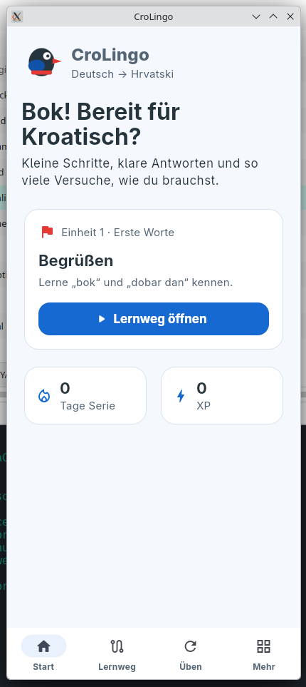

# CroLingo

[](https://github.com/marcelpetrick/CroLingo/actions/workflows/quality.yml)
[](https://github.com/marcelpetrick/CroLingo/actions/workflows/release.yml)


[](LICENSE)

CroLingo is a friendly, offline-first app for German-speaking beginners who
want to learn Croatian. It combines a short Adriatic-themed learning path with
matching, translation, fill-in-the-blank, and sentence-building exercises.
Answers are checked locally, mistakes receive a useful explanation, and every
exercise can be retried without a limit.

The app is built once with Flutter and runs on:

- Android 7.0/API 24 through Android 16/API 36;
- older ARM64 phones such as the Huawei Mate 20;
- current ARM64 phones such as Xiaomi/Poco devices;
- Linux x64 in a fixed 412×915 phone-shaped desktop window.

The first text-learning milestone is complete. The next phase expands the
course and adds device-provided Croatian playback. Native-speaker recordings,
learner recording, and pronunciation comparison remain later work.

## Current state



## Author

**Author: Marcel Petrick <mail@marcelpetrick.it>**

**License: GPLv3 or later. See `LICENSE`.**

**Note: projected is generated with AI.**

## What works today

- Croatian visual identity with an original crow mascot;
- shared Android and Linux navigation;
- a dashboard that starts or resumes the real next ordered lesson;
- a validated, bundled five-lesson starter course with 35 exercises;
- both recall directions for every starter concept;
- accessible Croatian playback using Android system TTS or local Linux speech;
- strict offline grading with Croatian characters preserved;
- matching, two-way translation, gaps, and sentence tiles;
- immediate correction, explanations, unlimited retries, and XP;
- durable local progress, lesson resume/unlocking, streaks, recent mistakes, and
  replay of recently learned lessons;
- a local vocabulary view with mastery for recognition, both recall directions,
  sentence production, and grammar application;
- private on-device statistics for XP, lessons, learned words, study days,
  streaks, and the first learning date;
- reproducible Android APK/AAB and native Linux builds;
- strict analysis, linting, tests, coverage, security scans, and CI.
- automated narrow-phone and 200% text-scaling layout checks.

FSRS-based due-date scheduling drives recommended reviews with 90% desired
retention. Fine-grained concept mastery is derived from durable answer history
without collecting personal data. Product direction lives in
[the implementation plan](docs/01_plan.md), while current priorities and
external checkpoints live in [the development roadmap](docs/02_roadmap.md).

## Bootstrap a fresh clone

Linux development requires Git, `curl`, `unzip`, `xz`, CMake, Ninja, Clang,
GTK 3 development headers, Java 21, and an Android SDK. Croatian playback on
Linux additionally uses `espeak-ng` or Speech Dispatcher. On Manjaro install it
with `sudo pacman -S espeak-ng`; on Ubuntu use
`sudo apt-get install espeak-ng`. With those system prerequisites available,
the repository installs its pinned Flutter and quality tools into the ignored
`.tooling/` directory:

For a complete Manjaro/Arch workstation setup, run:

```bash
sudo pacman -Syu
sudo pacman -S --needed base-devel git curl unzip xz cmake ninja clang pkgconf gtk3 jdk21-openjdk android-tools android-udev nodejs npm espeak-ng
sudo archlinux-java set java-21-openjdk
```

The Android SDK command-line tools must exist below `ANDROID_HOME`. This
workstation already uses `$HOME/Android/Sdk`; a fresh machine can install them
with Android Studio or Google's command-line tools before continuing.

```bash
./scripts/bootstrap.sh
```

The script is safe to rerun. It verifies downloads by checksum, reuses a
compatible Android SDK, installs missing pinned SDK components, fetches locked
Dart packages, and activates the tracked Git hooks. Nothing is installed into
the repository's tracked source tree.

Check the resulting environment with:

```bash
./scripts/flutterw doctor -v
./scripts/flutterw devices
```

## Run CroLingo

Start the native Linux development app:

```bash
./scripts/flutterw run -d linux
```

For Android, enable developer options and USB debugging on the phone, connect
it by USB, accept the computer's debugging key, then run:

```bash
adb devices
./scripts/flutterw run -d <device-id>
```

Inside the app, choose **Lernweg**, open the blue first lesson, complete each
exercise, read the feedback, and use **Weiter**. Course content and grading do
not need a network connection.

## Check every change

Run the same mandatory gate used by the local pre-commit hook and GitHub
Actions:

```bash
./localPipeline.sh --noRun
```

GitHub's constrained hosted runners use
`./localPipeline.sh --noRun --low-disk-builds`. This preserves every final
artifact while reclaiming disposable Android intermediates before the AAB.

Omit `--noRun` to launch the finished Linux bundle after all checks. The
pipeline validates repository policy, version progression, dependencies,
course content, Gradle-wrapper integrity, formatting, static analysis,
Flutter-specific linting, shell
and workflow files, Markdown, tests, coverage, Android lint, secrets,
vulnerabilities, clean builds, and final APK permissions.

Every commit must be conventional and atomic, bump the single version in
`pubspec.yaml`, and leave both platforms buildable. The project does not use
Git tags for versioning.

## Build distributable artifacts

Build the native Linux bundle:

```bash
./scripts/flutterw build linux --release
```

Build a universal APK, smaller per-architecture APKs, and the Play-compatible
Android App Bundle:

```bash
./scripts/flutterw build apk --release
./scripts/flutterw build apk --release --split-per-abi
./scripts/flutterw build appbundle --release
```

Outputs are written below `build/` and intentionally ignored by Git. Flutter's
development release APK uses a development signing setup; public distribution
must use a private release key stored outside this repository. Never commit a
keystore, password, service-account file, or generated artifact.

For either reference phone, install the smaller ARM64 development release APK:

```bash
adb install -r build/app/outputs/flutter-apk/app-arm64-v8a-release.apk
```

Alternatively, copy that APK to the phone and open it there. Android may ask
you to allow installation from the file-manager application. This locally
built APK is signed with Flutter's development key and is suitable for testing,
not public distribution. Rebuild it at any time with:

```bash
./scripts/flutterw build apk --release --split-per-abi
```

For a repeatable compatibility report, and optionally a safe development
install/launch, use:

```bash
./scripts/check_android_device.sh --serial <device-id>
./scripts/check_android_device.sh --serial <device-id> --install
```

Both reference phones are ARM64. The pipeline also produces `armeabi-v7a` and
`x86_64` variants plus a universal APK.

## Download a development release

The manually triggered **Development release** GitHub Action first runs the
complete quality pipeline. Only after every check and build passes does it
create a `vX.Y.Z` tag and a GitHub prerelease containing APKs, the AAB, the
Linux bundle, and SHA-256 checksums. No tag or release is created on failure.

After pushing the desired commit, start it from **Actions → Development
release → Run workflow**, or with the installed GitHub CLI:

```bash
gh workflow run release.yml --ref master
gh run watch
```

Open the repository's **Releases** page on either phone and download the file
ending in `arm64-v8a-development.apk`. These artifacts use a development key:
they are installable test packages, not production-signed Play Store releases,
and a later development release may require uninstalling the previous build.

## Project map

```text
assets/content/   validated offline Croatian course
docs/             specification, implementation plan, and open decisions
lib/app/          routing, shell, and app composition
lib/data/         asset and persistence adapters
lib/domain/       course and learning rules
lib/features/     screens and exercise presentation
scripts/          reproducible bootstrap and Flutter wrapper
test/             domain and end-to-end widget tests
```

Start with these documents before changing product behavior:

- [Product specification](docs/00_product_spec.md)
- [Implementation plan](docs/01_plan.md)
- [Prioritized development roadmap](docs/02_roadmap.md)
- [Questions and adopted defaults](docs/03_questions.md)
- [Course content and audio authoring](docs/04_content_and_audio_authoring.md)
- [AI agent working agreement](docs/AGENTS.md)

## Privacy and security

The text-first app requests no sensitive runtime permissions, has no release
network permission, analytics, ads, accounts, or telemetry, and disables
cleartext traffic and Android backup. Learning data stays in app-private local
storage. An outdated phone's operating-system vulnerabilities cannot be fixed
by an app; CroLingo limits its own attack surface and stores no secrets.

## License

CroLingo is free software licensed under the
[GNU General Public License version 3](LICENSE).
