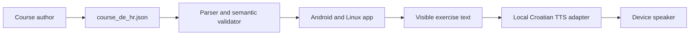
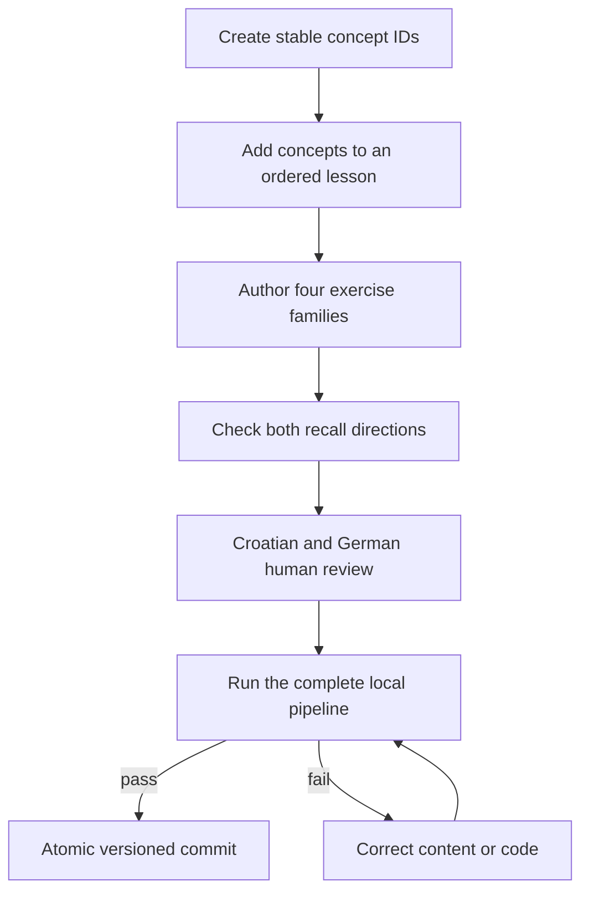
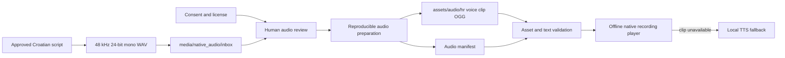

# Course content and audio authoring

This guide defines where CroLingo learning material lives and how authored
text and future native-speaker recordings move into the offline app. Stable IDs
connect exercises, progress, mastery, and eventually audio. Never rename an ID
after it has shipped.

## What works now

The complete course is the UTF-8 JSON file
`assets/content/course_de_hr.json`. It is bundled into both Android and Linux.
Croatian speaker buttons currently use the device's local text-to-speech voice:
Android uses the installed `hr-HR` system voice, while Linux uses Speech
Dispatcher or `espeak-ng`. No audio is downloaded and no microphone is used.



Native recordings are deliberately not wired into the app yet. Adding a file
alone will therefore not replace TTS today. The recording milestone will add
the manifest, asset player, validation, and fallback described below.

## Authoring exercise JSON

Add concepts to the top-level `concepts` list, then reference their IDs from
lessons and exercises. Use short lowercase ASCII IDs separated by hyphens, for
example `dobro-jutro`. IDs are storage keys, not display text.

Each early lesson should introduce about two new concepts. Every concept must
have at least three meaningful exposures and both recall directions. Each
exercise needs these fields:

| Field | Purpose |
| --- | --- |
| `id` | Globally unique, permanent exercise ID |
| `type` | `matching`, `translation`, `fillBlank`, or `sentence` |
| `masteryDimension` | Ability measured by this exercise |
| `prompt` | German instruction or the text to translate |
| `acceptedAnswers` | Strict answers; the first is shown as correction |
| `explanation` | Short German learning feedback |
| `conceptIds` | Stable concepts practised by the exercise |
| `pairs` | Two or more Croatian/German pairs for matching, otherwise empty |
| `tiles` | Ordered solution words for sentence tasks, otherwise empty |

Translation dimensions are `germanToCroatian` and `croatianToGerman`.
Matching uses `recognition`, gaps use `grammarApplication`, and sentence tasks
use `sentenceProduction`. Save real Croatian characters such as `č`, `ć`, `đ`,
`š`, and `ž` directly in UTF-8; do not replace them with ASCII approximations.



Run the focused validator while editing and the complete gate before commit:

```bash
dart run tool/validate_content.dart
./localPipeline.sh --noRun
```

The validator rejects duplicate IDs, missing references, incompatible mastery
dimensions, too few matching items or sentence tiles, too few concept
exposures, and a missing translation direction. Automated validation cannot
judge naturalness or pronunciation; a Croatian/German speaker must approve
release content.

## Keeping content separate from application code

Learning material is data, not Dart source. Keep Flutter behavior in `lib/` and
authored course data below `assets/content/`. JSON is the canonical exchange
format: it maps cleanly to typed Dart models, works well with schema and
semantic validation, supports Unicode directly, and is substantially less
verbose than XML. Do not embed exercises as Dart constants or introduce a
second XML representation.

As the curriculum grows, authors may work in a separate private content
repository or a purpose-built editor. That authoring source exports one
deterministic, schema-versioned JSON content pack. Content CI validates IDs,
language rules, media references, and hashes before an approved pack is copied
into this repository and bundled with a normal app release.


The installed app will not execute Dart, scripts, templates, or arbitrary HTML
from a content pack. Initial releases will not download content at runtime;
this preserves fully offline operation and reproducible review. If optional
pack installation is justified later, it must use a documented compatible
schema, size limits, cryptographic integrity and publisher verification,
transactional import, rollback, and the same semantic validator before any
content becomes visible.

## Native-speaker recording contract

When recording begins, each utterance will be identified by a permanent clip
ID. Prefer the concept ID when one canonical phrase is enough. Use a suffix for
context variants, such as `molim-request` and `molim-you-are-welcome`.

Record lossless masters with these settings:

- WAV, uncompressed PCM, mono, 48 kHz, 24-bit;
- one Croatian utterance per file, with roughly 250 ms of quiet at each end;
- natural neutral delivery, consistent distance, and no music or effects;
- no denoising, normalization, compression, or lossy export by the speaker;
- filename `<clip-id>.wav` and a non-personal speaker ID such as `voice-hr-01`.

The planned intake location is
`media/native_audio/inbox/<speaker-id>/<clip-id>.wav`. Speakers may put their
original WAV files there once the recording milestone starts. A consent and
license record must accompany each speaker batch; do not encode a person's
name, email address, or other personal data in filenames or audio metadata.

Raw masters will not be bundled into the app. A reproducible preparation script
will trim only approved silence, check peaks and duration, remove metadata, and
produce compact mono Opus-in-Ogg files at
`assets/audio/hr/<speaker-id>/<clip-id>.ogg`. The generated audio manifest will
map clip IDs to those assets and their exact Croatian text.



The future manifest will be authoritative for shipped audio. The pipeline will
reject a missing file, duplicate clip ID, unknown concept, mismatched text,
unsupported encoding, excessive duration, or unlicensed batch. Playback will
remain optional and text exercises will remain fully usable if a clip or local
voice is unavailable.

## Responsibilities

The course author owns JSON structure and German teaching text. A fluent
Croatian/German reviewer approves language content. Native speakers record only
the approved Croatian script and return the consent record. A maintainer runs
audio preparation and the pipeline; generated app assets must never be edited
by hand.
