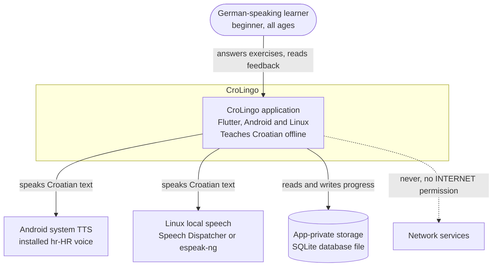
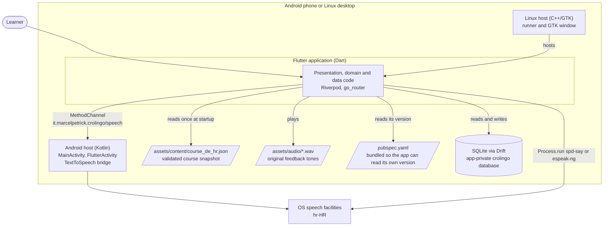
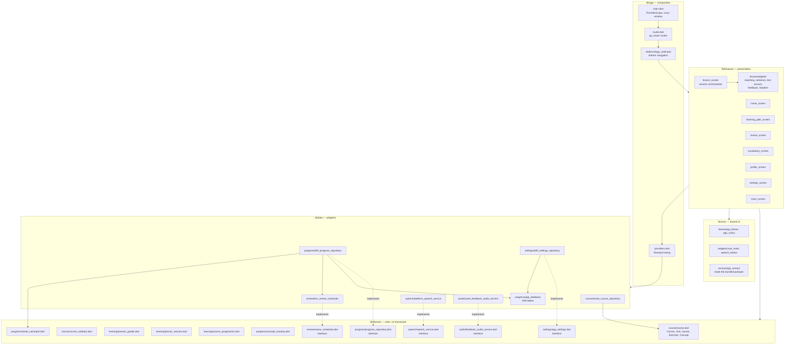
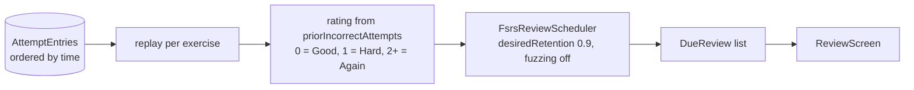
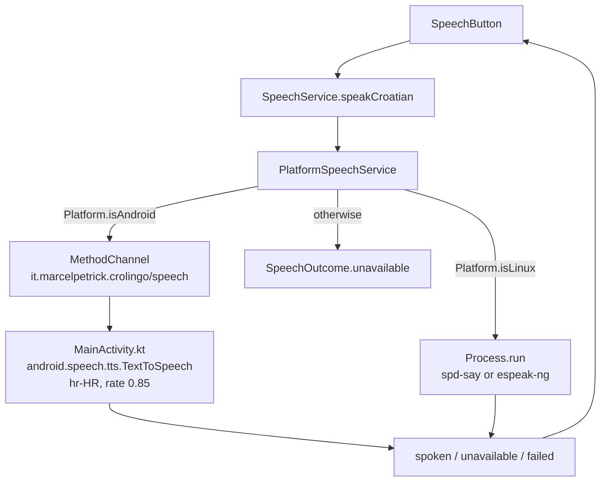
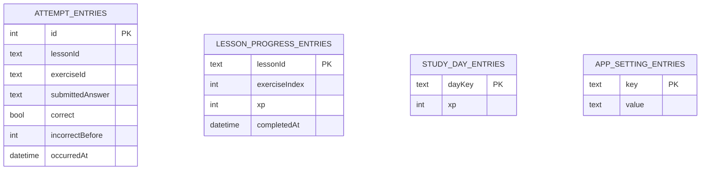
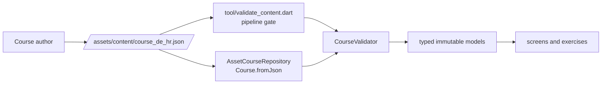

# CroLingo architecture overview

This document describes how CroLingo is actually built, following the C4 model:
system context, containers, components, and a few code-level views of the
paths that matter most. Product intent lives in
[the product specification](00_product_spec.md) and
[the implementation plan](01_plan.md); this document describes structure.

Diagrams use Mermaid `flowchart` and `sequenceDiagram` notation rather than
Mermaid's experimental C4 blocks, because the former renders reliably
everywhere the repository is read. The C4 *levels* are what matter here, not
the notation.

## Level 1: System context

CroLingo is a single offline application. There is no backend, no account, and
no network dependency; the only external systems are the speech facilities the
operating system already provides.



Two properties are structural rather than incidental. The release build
declares no `INTERNET` and no microphone permission, so no component may
introduce a network or recording dependency. Speech is an *optional
enhancement*: when no Croatian voice exists, the learning flow stays fully
usable and the failure is reported accessibly.

## Level 2: Containers

"Container" here means a separately running or separately deployed piece. One
Flutter application is compiled twice, once per platform host, and ships with
its content and tones as bundled assets.



The two hosts differ only in window hosting and speech dispatch. Android is a
responsive portrait layout; Linux is a fixed, non-resizable 412x915 logical
window created in `main.dart` through `window_manager`. Product behaviour is
otherwise identical, which is why almost all logic lives above this boundary.

## Level 3: Components inside the Flutter application

The code is layered by directory, and the dependency rule is one-directional:
`features` and `data` depend on `domain`, and `domain` depends on nothing but
Dart. Interfaces are declared in `domain`; implementations live in `data`.



### Composition root

`providers.dart` is the only place where concrete adapters are chosen. Every
screen receives behaviour through a Riverpod provider or a constructor
parameter, which is what makes the domain testable without a device:

| Provider | Supplies | Concrete adapter |
| --- | --- | --- |
| `courseProvider` | validated `Course` snapshot | `AssetCourseRepository` |
| `databaseProvider` | Drift database lifecycle | `AppDatabase` |
| `progressRepositoryProvider` | attempts, checkpoints, statistics | `DriftProgressRepository` |
| `settingsRepositoryProvider` | durable preferences | `DriftSettingsRepository` |
| `appSettingsProvider` | reactive `AppSettings` stream | derived |
| `feedbackAudioServiceProvider` | answer tones | `AssetFeedbackAudioService` |
| `speechServiceProvider` | Croatian pronunciation | `PlatformSpeechService` |
| `appVersionProvider` | running version for the dashboard | `AppVersion` |

### Domain rules worth knowing

- **Grading is strict and offline.** `AnswerGrader` normalizes Unicode to NFC
  and collapses whitespace, then compares against authored accepted answers.
  It never removes diacritics or guesses.
- **A lesson cannot be failed.** `LessonSession` tracks the exercise index, XP,
  and prior incorrect attempts. A correct answer earns
  `(10 - 2 * incorrectAttempts).clamp(2, 10)`, and completing the final
  exercise adds 10. Retries are unlimited and a wrong answer costs only XP.
- **Progression is derived, not stored.** `CourseProgression.next` walks
  ordered units and lessons against saved checkpoints to find the lesson to
  start or resume, including across unit boundaries.
- **Mastery is computed from history.** `ConceptMasteryCalculator` derives a
  score per `MasteryDimension` from persisted attempts, so mastery can decay
  and never becomes a stored flag.

Exercises are typed by `ExerciseType` (`matching`, `translation`, `fillBlank`,
`sentence`) and independently classified by `MasteryDimension`
(`recognition`, `germanToCroatian`, `croatianToGerman`, `sentenceProduction`,
`grammarApplication`). The two are deliberately separate: the type describes
the interaction, the dimension describes the ability being measured.

## Level 4: Selected code-level views

### Answering one exercise

This is the hot path and it shows where each responsibility lives.

```mermaid
sequenceDiagram
  actor Learner
  participant Screen as LessonScreen
  participant Session as LessonSession
  participant Grader as AnswerGrader
  participant Repo as DriftProgressRepository
  participant Fsrs as FsrsReviewScheduler
  participant Db as SQLite
  participant Tones as AssetFeedbackAudioService

  Learner->>Screen: submit answer
  Screen->>Session: submit(answer)
  Session->>Grader: grade(exercise, answer)
  Grader-->>Session: GradeResult(isCorrect, correction)
  Session-->>Screen: state with grade and XP
  Screen->>Repo: recordAttempt(lesson, exercise, answer, correct, incorrectBefore, occurredAt)
  Repo->>Db: insert AttemptEntries row (UTC)
  Screen->>Tones: play(success or failure)
  Note over Tones: optional; failure is swallowed
  Screen-->>Learner: correction, explanation, retry or continue

  Learner->>Screen: finish lesson
  Screen->>Repo: saveLessonProgress(checkpoint)
  Repo->>Db: upsert LessonProgressEntries and StudyDayEntries
  Note over Repo,Fsrs: due dates are reconstructed later,<br/>not written here
```

### Reconstructing due reviews

CroLingo stores no scheduler state per exercise. `loadDueReviews` replays the
persisted attempt history through the FSRS adapter, mapping first-attempt
correct to Good, one prior error to Hard, and two or more to Again. The
schedule is therefore always consistent with the attempt log, and swapping the
scheduler cannot corrupt stored data.



### Speaking Croatian

One `SpeechService` interface hides two very different mechanisms, and both
report an outcome instead of throwing.



## Persistence model

Four Drift tables in one app-private SQLite database, currently at
`schemaVersion` 2 with a forward-only migration that added settings.



Timestamps are persisted in UTC. Local calendar dates are derived only at the
boundary, when a completed lesson is folded into `StudyDayEntries`, because a
study day is a human-facing concept and a timestamp is not. `AppSettingEntries`
is a key/value table on purpose, so a new preference needs no migration.

## Content pipeline

Course material is data, never Dart source.



`CourseValidator` runs both in the build pipeline and at runtime parse time. It
rejects duplicate IDs, empty units or lessons, exercises without accepted
answers, matching exercises with fewer than two pairs, sentence exercises with
fewer than two tiles, unknown concept references, concepts with fewer than
three exposures, and any concept missing either recall direction. Automated
validation cannot judge naturalness, so human Croatian/German review remains a
separate, external checkpoint.

## Cross-cutting decisions

- **Offline-first is enforced, not intended.** The pipeline inspects the final
  APK and fails on `INTERNET`, `RECORD_AUDIO`, `CAMERA`, location, contacts, or
  external-storage permissions.
- **Every platform capability sits behind a replaceable interface.** Speech,
  tones, scheduling, persistence, and the asset bundle all accept an injected
  substitute, which is why the suite runs headless and deterministically.
- **Optional enhancements never block learning.** Missing Croatian voices and
  audio failures degrade silently; `AssetFeedbackAudioService` deliberately
  swallows playback exceptions.
- **Generated code is verified, not trusted.** `app_database.g.dart` is
  regenerated in the pipeline and the run fails if the committed file differs.
- **Accessibility is structural.** Correctness is signalled by icon, label, and
  shape as well as colour, and layouts are checked at 320 logical pixels and
  200% text scaling by automated tests.

## Known architectural debt

- `lesson_screen.dart` remains the largest presentation file. The exercise
  families were extracted into `lib/features/lesson/widgets/`, so it now only
  orchestrates the session, but it still owns routing between the families and
  the feedback lifecycle.
- Coverage sits a little above the 95% floor rather than comfortably clear of
  it, so a single untested branch can turn the pipeline red.
- Native-speaker audio, listening exercises, and pronunciation assessment are
  deliberately absent. The contract they must satisfy is specified in
  [the content and audio authoring guide](04_content_and_audio_authoring.md).
