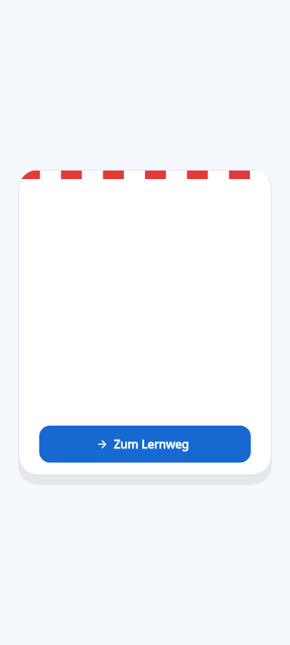

# UI and motion language

CroLingo uses motion as feedback, not as a gate. Transitions are short,
finish on their own, and never prevent the learner from pressing the next
action. The visual language remains original: Adriatic blue, restrained
Croatian red and white checks, the geometric crow, and gold rewards.



Run the interactive preview from the repository root:

```shell
scripts/flutterw run -d linux -t tool/ui_motion_preview.dart
```

## Motion map

| Moment | Treatment | Purpose |
| --- | --- | --- |
| Screen content | Short fade and 14-pixel rise | Preserve orientation |
| Learning path | Staggered nodes, capped at 252 ms | Reveal progression |
| Exercise change | 160 ms fade and horizontal shift | Connect adjacent tasks |
| Lesson progress | 280 ms eased fill and XP count | Make earned progress legible |
| Correct answer | Rising panel and elastic check | Reinforce success |
| Incorrect answer | Rising panel and brief icon shake | Draw attention without punishment |
| Completion | 900 ms crow bounce, crown, burst, and XP count | Reward effort |

The completion action remains enabled during its decorative animation. No
looping production animation keeps the interface busy after the state change.

## Accessibility

The app combines motion with text, shape, iconography, and sound; animation is
never the only signal. It honors the operating system's reduced-motion flag
and adds a persistent **Bewegungen reduzieren** preference. Either setting
makes CroLingo motion widgets render their final state immediately.

All five appearances keep text at WCAG AA or better. The high-contrast
appearance is held to AAA. Interactive primary and accent icons are checked at
the 3:1 non-text contrast floor, including selected navigation surfaces.
