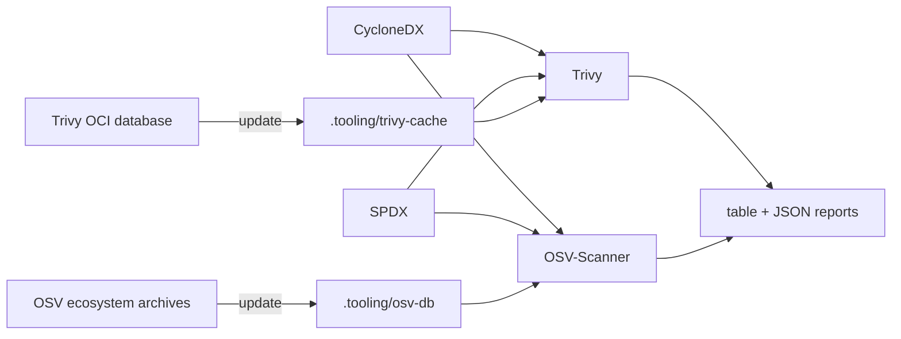
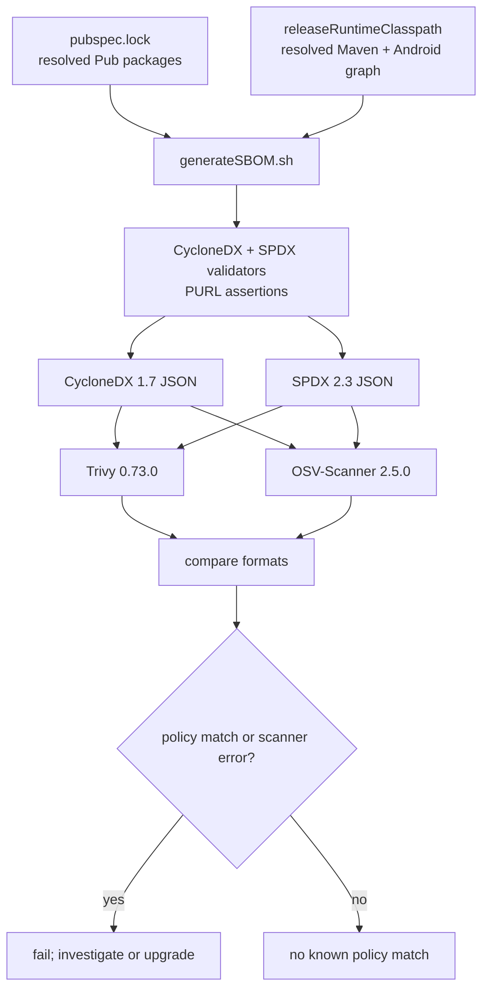
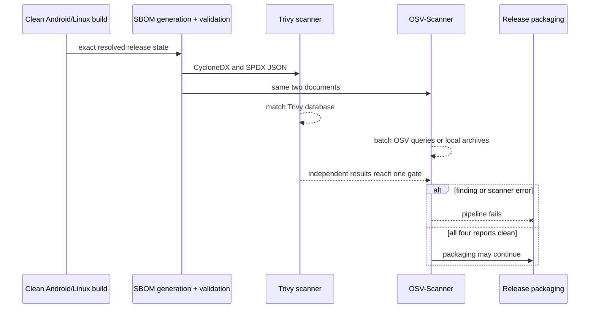

# Local SBOM vulnerability checks

Implementation status: complete. The root commands, pinned scanners,
online/offline operation, reports, and mandatory pipeline gate described below
are implemented and verified.

CroLingo scans both published software bills of materials with
[Trivy](https://trivy.dev/docs/latest/guide/target/sbom/) and the open-source
[OSV-Scanner](https://google.github.io/osv-scanner/). The check answers a
precise question: does either current vulnerability database contain a known
advisory matching a component and version identified by either SBOM? A clean
report is valuable evidence, but it cannot prove that the application has no
unknown vulnerability, logic defect, compromised build input, unsafe
configuration, or unpatched operating-system problem.

## Implementation plan

1. Keep `scripts/generate_sbom.sh` as the only generator implementation and add
   the requested root `generateSBOM.sh` entry point. This prevents two local
   commands from producing different inventories.
2. Bootstrap Trivy 0.73.0 from its official Linux release archive, pinned by
   the upstream SHA-256 digest. Do not use Docker `latest`, an installer pipe,
   or mutable Trivy Action tags.
3. Use the already checksum-pinned OSV-Scanner 2.5.0 as an independent matcher
   over both SBOMs. It uses batched OSV queries online and official ecosystem
   archives offline.
4. Add `checkSBOMCVEs.sh`. By default it regenerates and validates both SBOMs,
   scans both with both tools, and writes table and JSON reports. Trivy blocks
   HIGH or CRITICAL matches; OSV blocks any known advisory. `--existing` avoids
   regeneration; `--offline` forbids database updates; and
   `--download-db-only` prepares both caches for later offline work.
5. Require Pub and Maven Package URLs before scanning. Derive OSV's documented
   package inventory from each validated SBOM, require the exact Pub and Maven
   counts, then compare normalized findings from CycloneDX and SPDX so a
   parser/format regression cannot silently hide a result in one
   representation.
6. Run the same check as a mandatory local/GitHub pipeline stage after SBOM
   generation. A database, parsing, or scanner failure is a pipeline failure,
   not a clean security result.
7. ShellCheck every script, exercise online and offline database paths, inspect
   the reports, run the complete pipeline, review the diff, and commit only the
   verified result.

## Daily commands

Generate and validate both SBOMs:

```bash
./generateSBOM.sh
```

Generate fresh SBOMs and scan them with the default release policy:

```bash
./checkSBOMCVEs.sh
```

Reuse already generated SBOMs:

```bash
./checkSBOMCVEs.sh --existing
```

Scan more than the blocking severities:

```bash
./checkSBOMCVEs.sh --severity UNKNOWN,LOW,MEDIUM,HIGH,CRITICAL
```

Reports are ignored build outputs below `build/security/cve/`. Each scanner and
format gets a readable `.txt` report and a machine-readable `.json` report. An
OSV input inventory for each format is retained beside the reports for audit.
An empty vulnerability list is a successful result; missing reports, malformed
SBOMs, extraction-count mismatches, scanner errors, or policy-matching
vulnerabilities produce a nonzero exit.

## Online and offline databases

Trivy and OSV must initially download their vulnerability data. Prepare or
refresh both repository-local caches with:

```bash
./checkSBOMCVEs.sh --download-db-only
```

After that succeeds, scan without network database access:

```bash
./checkSBOMCVEs.sh --existing --offline
```

The caches live at `.tooling/trivy-cache/` and `.tooling/osv-db/`. Neither is
committed. `--offline` disables Trivy's Java and advisory updates and directs
OSV-Scanner to local Pub and Maven archives without sending dependency
information to an API. The command fails if a required database is absent;
silently falling back to an empty substitute would create false confidence.
The script prints Trivy's update timestamps. Refresh both caches before an
important offline release check.



For a genuinely air-gapped machine, populate the same cache using a trusted
internet-connected machine with the identical pinned tool versions, transfer
both caches through the organization's approved integrity-checked process, and
then use `--offline`. The scripts do not automate removable-media trust
decisions.

## Identification quality and PURLs

Package URLs are the primary unambiguous ecosystem identifiers. The current
inventory contains resolved `pkg:pub/...` and `pkg:maven/...` identifiers plus
CroLingo's `pkg:generic/...` identity in both representations. The scan script
requires at least one Pub and one Maven PURL, then requires each derived OSV
inventory and result to contain all 138 Pub and 53 Maven packages in the
current documents. These counts are assertions derived at runtime, not values
hard-coded into the script.



Trivy warns that third-party-generated SBOMs may lack Trivy-specific private
properties used by some of its detectors. During the 2026-08-10 review, a
positive control also showed that OSV knew a recent Pub advisory that Trivy's
database did not. CroLingo therefore uses OSV both for its earlier source scan
and now directly against both SBOMs. Independent feeds reduce one blind spot;
they do not guarantee complete advisory, native-binary, or ecosystem coverage.

The same review found that OSV-Scanner 2.5.0's direct SBOM reader discarded the
Maven namespace: for example, it queried `activity` instead of
`androidx.activity:activity`. That can silently miss advisories. The script
therefore converts only resolved Pub and Maven identities from each already
validated SBOM into OSV-Scanner's documented JSON inventory, preserving the
exact `group:artifact` name. This is a generated compatibility adapter, not a
manual dependency list. Package counts and the complete normalized inventories
must agree across CycloneDX and SPDX, and a positive-control review confirmed
that the qualified path detects vulnerable Pub and Maven packages. Remove the
adapter only after an upgraded scanner passes the same regression review.

## Pipeline and response policy

The complete pipeline generates the SBOM after clean builds, then runs the CVE
check against those exact files. Quality and Release therefore use the same
script and policies as a Manjaro workstation. Trivy blocks HIGH/CRITICAL
matches; OSV blocks any advisory because incomplete severity metadata must not
be interpreted as harmless. Release stops before tagging or publication on a
matching vulnerability or operational scanner failure.



Do not dismiss a finding solely because the package is transitive, currently
unfixed, or appears to be development-only. First confirm reachability and
which resolved graph introduced it. Prefer upgrading or removing the affected
component. Any future exception needs a reviewed, expiring rationale tied to
the exact vulnerability and version range; this implementation intentionally
starts with no ignore file and no suppressed vulnerability.

## Manjaro notes

No system-wide scanner or Docker installation is required. The normal
bootstrap installs checksum-verified Trivy and OSV-Scanner binaries below
`.tooling/bin/`. System packages are still discoverable with `pacman -Ss`, but
using repository pins keeps local and GitHub checks identical. Docker would
add image, mount, ownership, and network concerns without improving this
file-based use case, so the native binaries are the smaller maintenance
surface here.
