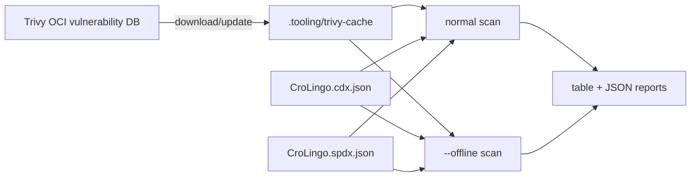
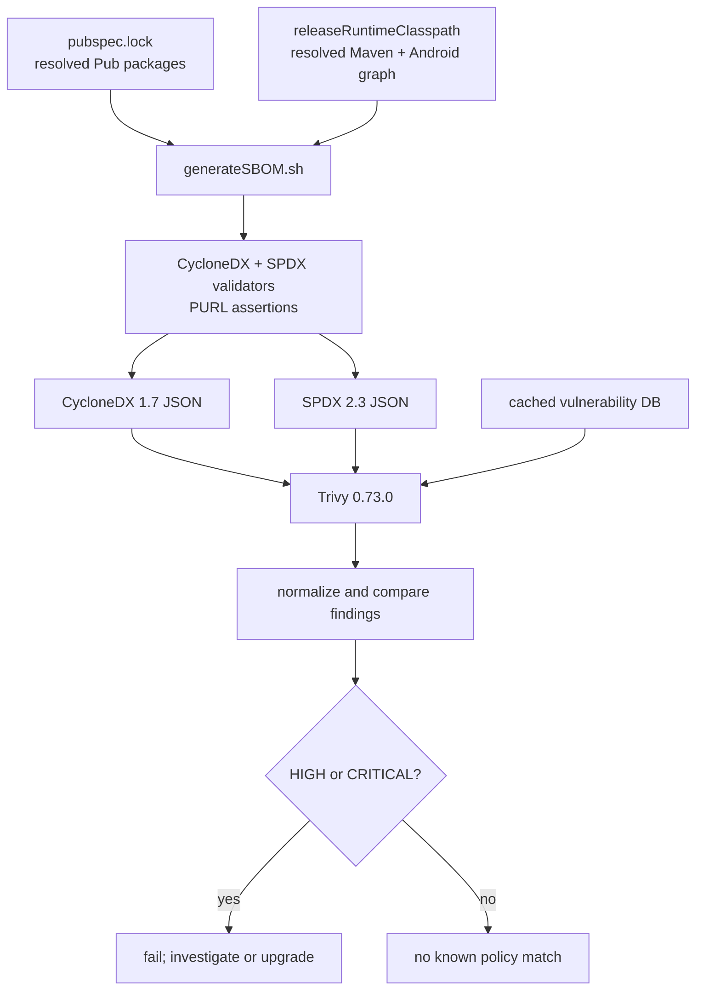
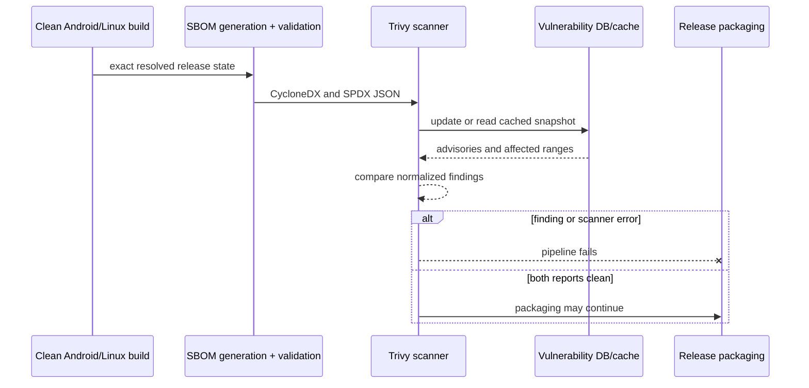

# Local SBOM vulnerability checks

Implementation status: complete. The root commands, checksum-pinned scanner,
online/offline operation, reports, and mandatory pipeline gate described below
are implemented and verified.

CroLingo scans both published software bills of materials with
[Trivy](https://trivy.dev/docs/latest/guide/target/sbom/). The check answers a
precise question: does the current Trivy database contain a known vulnerability
matching a component and version identified by either SBOM? A clean report is
valuable evidence, but it cannot prove that the application has no unknown
vulnerability, logic defect, compromised build input, unsafe configuration, or
unpatched operating-system problem.

## Implementation plan

1. Keep `scripts/generate_sbom.sh` as the only generator implementation and add
   the requested root `generateSBOM.sh` entry point. This prevents two local
   commands from producing different inventories.
2. Bootstrap Trivy 0.73.0 from its official Linux release archive, pinned by
   the upstream SHA-256 digest. Do not use Docker `latest`, an installer pipe,
   or mutable Trivy Action tags.
3. Add `checkSBOMCVEs.sh`. By default it regenerates and validates both SBOMs,
   scans both with one repository-local database cache, writes table and JSON
   reports, and fails on HIGH or CRITICAL findings. `--existing` avoids a
   deliberate regeneration; `--offline` forbids database updates; and
   `--download-db-only` prepares the cache for later offline work.
4. Require Pub and Maven Package URLs before scanning. Compare normalized
   findings from CycloneDX and SPDX so a parser/format regression cannot
   silently hide a result in one representation.
5. Run the same check as a mandatory local/GitHub pipeline stage after SBOM
   generation. A database, parsing, or scanner failure is a pipeline failure,
   not a clean security result.
6. ShellCheck every script, exercise online and offline database paths, inspect
   the reports, run the complete pipeline, review the diff, and commit only the
   verified result.

## Daily commands

Generate and validate both SBOMs:

```bash
./generateSBOM.sh
```

Generate fresh SBOMs and scan them with the default release policy:

```bash
./checkSBOMCVEs.sh
```

Reuse already generated SBOMs:

```bash
./checkSBOMCVEs.sh --existing
```

Scan more than the blocking severities:

```bash
./checkSBOMCVEs.sh --severity UNKNOWN,LOW,MEDIUM,HIGH,CRITICAL
```

Reports are ignored build outputs below `build/security/trivy/`. Each format
gets a readable `.txt` report and a machine-readable `.json` report. An empty
vulnerability list is a successful result; missing reports, malformed SBOMs,
scanner errors, or policy-matching vulnerabilities produce a nonzero exit.

## Online and offline databases

Trivy's vulnerability database must initially be downloaded from its upstream
OCI registry. Prepare or refresh CroLingo's repository-local cache with:

```bash
./checkSBOMCVEs.sh --download-db-only
```

After that succeeds, scan without network database access:

```bash
./checkSBOMCVEs.sh --existing --offline
```

The cache lives at `.tooling/trivy-cache/`, is never committed, and is reused
by later local runs. `--offline` also disables Java-database updates. It fails
if the required cached database is absent; silently falling back to an empty or
stale substitute would create false confidence. The script prints update,
download, and next-update timestamps from the cached database metadata, so its
age remains visible when interpreting a clean scan.



For a genuinely air-gapped machine, populate the same cache using a trusted
internet-connected machine with the identical pinned Trivy version, transfer
it through the organization's approved integrity-checked process, and then use
`--offline`. The scripts do not automate removable-media trust decisions.

## Identification quality and PURLs

Package URLs are the primary unambiguous ecosystem identifiers. The current
inventory contains resolved `pkg:pub/...` and `pkg:maven/...` identifiers plus
CroLingo's `pkg:generic/...` identity in both representations. The scan script
requires at least one Pub and one Maven PURL before invoking Trivy.



Trivy warns that third-party-generated SBOMs may lack Trivy-specific private
properties used by some of its detectors. CroLingo mitigates that limitation
with resolved versions, ecosystem PURLs, both standard representations, Trivy
plus the existing OSV-Scanner source scan, and strict format validation. It
does not claim that two scans magically guarantee complete vulnerability-feed
or ecosystem coverage.

## Pipeline and response policy

The complete pipeline generates the SBOM after clean builds, then runs the CVE
check against those exact files. Quality and Release therefore use the same
script and default HIGH/CRITICAL policy as a Manjaro workstation. Release stops
before tagging or publication on a matching vulnerability or operational
scanner failure.



Do not dismiss a finding solely because the package is transitive, currently
unfixed, or appears to be development-only. First confirm reachability and
which resolved graph introduced it. Prefer upgrading or removing the affected
component. Any future exception needs a reviewed, expiring rationale tied to
the exact vulnerability and version range; this implementation intentionally
starts with no ignore file and no suppressed vulnerability.

## Manjaro notes

No system-wide Trivy or Docker installation is required. The normal bootstrap
installs the checksum-verified binary below `.tooling/bin/`. System packages
are still discoverable with `pacman -Ss trivy`, but using the repository pin
keeps local and GitHub checks identical. Docker would add an image digest,
volume mounts, cache ownership, and network configuration without improving
this file-based use case, so the native static release is the smaller trust and
maintenance surface here.
