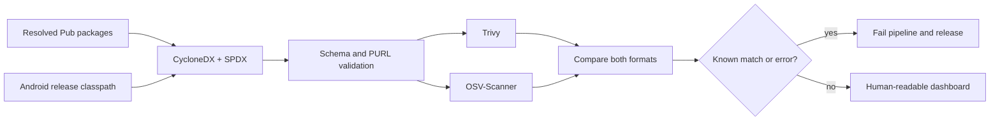

# CVE and SBOM security overview

CroLingo evaluates its resolved software dependencies with two independently
maintained open-source vulnerability scanners. The goal is to make known
dependency risk visible locally, in GitHub quality checks, and before a release
is published.

## What is checked

- CycloneDX 1.7 and SPDX 2.3 SBOMs are generated from the resolved Pub lockfile
  and Android release classpath.
- Pub and Maven components contain Package URLs (PURLs) for unambiguous
  ecosystem and version matching.
- Trivy 0.74.0 scans both SBOM formats and blocks known High or Critical
  findings.
- OSV-Scanner 2.5.1 independently scans both inventories and blocks every
  matched advisory, including advisories without reliable severity metadata.
- CycloneDX and SPDX package inventories and normalized results must agree.
- Missing reports, malformed input, database errors, scanner errors, or
  extraction-count differences fail the pipeline instead of being treated as
  a clean result.

The OSV compatibility inventory is generated from each validated SBOM. It
preserves qualified Maven identities such as `group:artifact`; dependencies are
not copied into a manually maintained list.



## Human-readable dashboard

Every completed evaluation produces a responsive, self-contained HTML
dashboard. It summarizes:

- overall pass or action-required status;
- resolved Pub and Maven package counts;
- Trivy and OSV result counts;
- Trivy severity totals;
- CycloneDX/SPDX agreement;
- findings that need investigation; and
- provenance: application version, commit, evaluation time, scan mode, scanner
  policy, scanner version, and whether local changes were present.

The dashboard contains no JavaScript, external assets, telemetry, or network
requests. Scanner-controlled values are HTML-escaped. Raw JSON reports and
scanner exit codes remain authoritative; the dashboard is a presentation layer,
not the security gate.

## Local commands

Generate fresh SBOMs, scan them, and create the dashboard:

```bash
./checkSBOMCVEs.sh
```

Open the result:

```bash
xdg-open build/security/cve/dashboard.html
```

Regenerate only the dashboard from existing scan reports:

```bash
./generateCVEReport.sh --report-dir build/security/cve
```

Prepare local vulnerability databases and then scan without database network
access:

```bash
./checkSBOMCVEs.sh --download-db-only
./checkSBOMCVEs.sh --existing --offline
```

The ignored local caches are `.tooling/trivy-cache/` and `.tooling/osv-db/`.
Refresh them before relying on an important offline evaluation.

## GitHub and release behavior

The normal quality workflow and manually dispatched release workflow run the
same `localPipeline.sh` used by developers. The generated dashboard, metadata,
raw reports, and scanner inventories are uploaded in the pipeline-report
artifact. A scanner finding or operational failure prevents release
publication.

## What a clean result means

A clean evaluation means the configured vulnerability databases did not match
a known advisory to the identified Pub or Maven package versions at that point
in time. It is useful security evidence, but it does not prove that CroLingo is
universally safe.

A clean dependency scan cannot rule out:

- vulnerabilities that are not yet public or present in the databases;
- application logic and configuration defects;
- compromised build inputs or developer machines;
- operating-system vulnerabilities on an Android or Linux device;
- native or runtime components missing from the generated inventory; or
- vulnerabilities that require a reachability or exploitability assessment.

For implementation details, limitations, report paths, and response policy,
see [Local SBOM vulnerability checks](cveCheck.md) and the
[SBOM implementation plan](06_sbom_plan.md).
