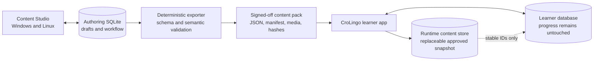
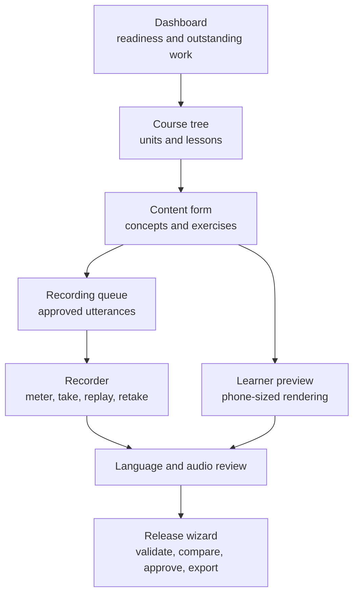
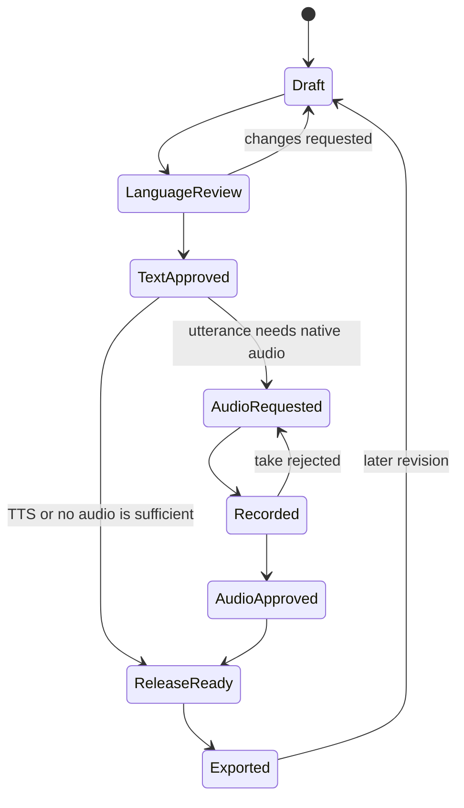

# CroLingo Content Studio

This document proposes a friendly desktop authoring application for course
editors, language reviewers, and native speakers. Its working name is
**CroLingo Content Studio**. It must hide JSON, database tables, filenames, and
audio tooling during normal work while producing deterministic, reviewable
content for the learner application.

## Recommendation

Build a separate Flutter desktop application for Windows and Linux inside this
repository at `tools/content_studio/`. Flutter is already CroLingo's UI
technology and officially supports native applications and plugins on both
desktop platforms. Windows builds must run on Windows and Linux builds on
Linux, so CI needs one runner for each platform. See Flutter's
[desktop documentation](https://docs.flutter.dev/platform-integration/desktop)
and [supported-platform matrix](https://docs.flutter.dev/reference/supported-platforms).

Keep it as an auxiliary application package, not a feature compiled into the
learner executable. The monorepo retains one SemVer source in the root
`pubspec.yaml`; editor builds receive that version from repository tooling.
This avoids shipping authoring dependencies, microphone access, and private raw
recordings in the learner app while allowing shared Dart packages for content
models, migrations, validation, and deterministic export code.

The first useful release should import and export CroLingo's current JSON. It
should not wait for native audio playback or runtime content downloads.

## The three data lifecycles

CroLingo already has a versioned Drift/SQLite database at schema version 2. It
stores attempts, lesson checkpoints, study days, and settings. It does **not**
store course content. The current course is the bundled
`assets/content/course_de_hr.json`, which does not yet declare a content schema
version.

The editor should not write into the learner database. Three independent stores
are safer:

| Store | Owner | Contains | Versioning |
| --- | --- | --- | --- |
| Authoring database | Content Studio | Editable course graph, drafts, reviews, recording metadata | Forward-only integer schema migrations |
| Runtime content store | CroLingo app | Approved text and media index only | Content schema plus content release version |
| Learner database | CroLingo app | Attempts, progress, review history, settings | Existing forward-only Drift migrations |



Initially, the runtime content store remains the existing validated JSON asset.
When course size or downloadable packs justify it, CroLingo can transactionally
import an approved pack into a separate content SQLite database. It should
build the new database beside the active one, validate it, then atomically swap
it. A failed import keeps the prior content. Learner progress is never rebuilt
or deleted during a content update.

## Stable identity and compatibility

IDs are permanent public keys once released. Renaming or reusing concept,
lesson, exercise, utterance, speaker, or recording IDs is forbidden. Display
text may change. If an exercise's meaning or grading contract changes
substantially, create a new exercise ID and retire the old one so historical
attempts do not acquire a different meaning.

Use four independent versions:

1. Repository SemVer shared by CroLingo and Content Studio, defined only in the
   root `pubspec.yaml`.
2. Authoring database integer schema version.
3. Exported content format integer `schemaVersion`.
4. Approved course release SemVer and monotonically increasing
   `contentRevision`.

Every exported manifest should include `courseId`, `schemaVersion`,
`contentVersion`, `contentRevision`, `minimumAppVersion`, language tags,
ordered file entries, sizes, and SHA-256 hashes. Exports must use normalized
UTF-8, stable key ordering, stable list ordering, LF endings, and no volatile
timestamp. Identical approved input must produce byte-identical output.

The learner app declares the content schema versions it understands. The
editor can evolve first while still exporting the old schema; new app code can
support both old and new schemas during a transition. The app repository pins
one approved exported snapshot, so app and content work can proceed in
parallel without reading each other's unfinished databases.

## Authoring model

Use normalized SQLite tables in the editor rather than one JSON blob. The
minimum model is:

- courses, units, lessons, concepts, and ordered lesson items;
- exercises, accepted answers, matching pairs, tiles, distractors, and mastery
  dimensions;
- utterances with exact text, `hr-HR` or `de-DE`, context, and TTS text;
- speakers, consent/license records, recording takes, reviews, and approvals;
- grammar notes, tags, difficulty, retirement state, and change notes;
- immutable export records containing version, reviewer, hashes, and status.

Audio files should remain normal files, not SQLite BLOBs. The database stores
relative paths, hashes, format facts, status, and relationships. A project is a
folder containing the authoring database, a media tree, and automatic backups;
the whole folder is the backup unit.

## Main user experience

The application should open into a dashboard showing validation failures,
unreviewed text, missing recordings, rejected takes, and the last approved
export. Normal editing uses autosave, undo/redo, keyboard shortcuts, searchable
tables, and clear unsaved/export states.



Recommended screens:

- **Course tree:** reorder units, lessons, and exercises with guarded drag and
  drop; retired items remain visible in history.
- **Concept editor:** Croatian, German, usage/context, notes, and linked
  exercises with exposure and recall-direction counters.
- **Exercise builder:** type-specific forms and a live learner preview; users
  never edit irrelevant empty arrays.
- **Utterance library:** deduplicated phrases, both language tags, recording
  coverage, speaker, license, waveform, and all places where a phrase is used.
- **Recording desk:** input-device selection, level meter, count-in, one-click
  record/stop, replay, keep/reject, notes, and next-script navigation.
- **Review queue:** side-by-side German/Croatian approval and separate audio
  approval with an audit trail.
- **Release wizard:** validation summary, changes since the prior export,
  compatibility result, explicit sign-off, and deterministic output location.

## Text and exercise workflow



The editor continuously runs fast field and reference checks. Full export adds
the same semantic validation as CroLingo: unique stable IDs, known references,
valid exercise/type combinations, accepted answers, minimum exposures, and
both recall directions. It should also warn about changed released IDs,
unintroduced concepts, duplicate phrases, suspicious punctuation or Unicode,
missing translations, and changed accepted-answer semantics.

Automated checks never approve language naturalness. Croatian/German review is
an explicit human gate, and AI suggestions remain drafts with recorded
provenance until a person approves them.

## Recording and playback model

Every speakable string becomes an `Utterance` with a stable ID, exact text,
language tag, context, and optional native recordings. The same utterance may
be reused by concepts, prompts, answers, explanations, and future listening
exercises. A recording is one speaker's take of one utterance; it never owns
the text.

Version one records the Croatian vocabulary utterances with one native speaker
using an ordinary headset microphone. This is accepted as an iterative starting
point, not treated as studio-quality input. The recorder captures lossless mono
WAV masters at 48 kHz and 24-bit when the device supports it and flags clipping,
low level, excessive noise or silence, wrong channel count, unexpected sample
rate, duration outliers, and text changed after recording. Every take remains
replaceable without changing its utterance ID.

The editor keeps raw approved masters and consent records. A reproducible
export step strips metadata, trims only approved boundary silence, normalizes
to the agreed safe target, and creates compact app assets. Noise reduction must
be optional, previewable, explicitly approved, and never overwrite the raw
take. Quality can therefore improve later without changing course references.

The learner setting is separate for Croatian and German:

- **Automatic** (recommended): approved native recording, otherwise local TTS;
- **Native recording:** play a recording and report clearly if unavailable;
- **Device voice:** always use installed `hr-HR` or `de-DE` TTS;
- **Off:** hide or disable automatic speech while retaining manual text use.

Version one exposes one approved native Croatian speaker. The schema supports
multiple recordings, speakers, and styles later, similar to dictionary sites,
without making them visible before real variants exist. German uses device TTS
until approved German recordings are added. The content manifest maps each
utterance to available recordings and TTS fallback text; learner settings make
the final selection. Native audio and TTS share one playback boundary so
lessons remain usable when either source is unavailable.

## Export and integration

An approved pack should contain only generated files:

```text
manifest.json
course.json
audio-manifest.json
audio/hr/<speaker-id>/<utterance-id>.ogg
audio/de/<speaker-id>/<utterance-id>.ogg
licenses/<speaker-id>.json
SHA256SUMS.txt
```

Raw WAV masters, the editor database, private notes, and personal consent
documents are never bundled into the learner app. The manifest contains only
the minimum non-personal license facts needed to prove distribution rights.

Content CI should import the pack into a clean environment, validate schema and
semantics, verify every hash and media encoding, reject unknown or unlicensed
files, render representative exercise previews, and compare the deterministic
re-export. Only an approved pack version is copied into CroLingo and released
with the normal app pipeline. Runtime network downloads remain a separate later
decision requiring publisher signatures, rollback, size limits, and privacy
review.

## Safety, recovery, and collaboration

- Default to local-only operation with no account, analytics, or cloud upload.
- Ask for microphone permission only in Content Studio, never in CroLingo.
- Autosave each valid edit transaction and create rotating, verified backups.
- Provide restore, project integrity check, and export-before-migration.
- Migrate a copied authoring database first, verify it, then replace the
  original; never perform an irreversible in-place migration without backup.
- Keep speaker identities pseudonymous in content. Protect consent documents
  separately and define retention/deletion rules.
- Start with one active writer. Simultaneous editing, accounts, roles, and a
  synchronization server are out of scope.
- The same trusted native speaker may author, record, review, approve, and
  export in version one. Preserve an audit record even though this is not a
  separation-of-duties workflow.
- Keep the working authoring database, raw recordings, and private consent
  documents in an ignored local workspace. Commit editor source and approved
  deterministic exports only.

## Quality gates and distribution

Content Studio follows the same engineering floor as CroLingo: bootstrapping,
conventional atomic commits, the single repository SemVer, formatting, Dart
analysis, Flutter/custom lint, unit/widget/integration tests, shell and workflow
lint, dependency and secret scans, at least 95% authored Dart line coverage,
clean builds, and artifact inspection. Test database migration fixtures from
every supported schema and golden deterministic exports.

The root `localPipeline.sh` remains the mandatory final integration gate and
must validate the editor, exported content, bundled audio, and learner app. A
separate path-filtered `editor-quality.yml` workflow runs on pushes and pull
requests that touch `tools/content_studio/`, shared content packages, editor
fixtures, or content assets. It has a Linux quality/build job and a Windows
quality/build job, and uploads a portable Windows ZIP plus a checksummed Linux
bundle for testing. It does not tag or publish a public release.

Version one distributes a portable Windows ZIP; no installer is required. The
editor shows the repository version, authoring schema, content schema, and
project backup location in an About/Diagnostics screen.

## Implementation sequence

1. **Contract:** answer the ten questions below; define content schema v1,
   manifest, stable-ID rules, and wireframes.
2. **Shared core:** extract typed models, validator, migrations, and canonical
   serializer into platform-independent Dart packages with fixtures.
3. **Editor foundation:** create `tools/content_studio/` as a Flutter
   Windows/Linux application, with a versioned Drift authoring database,
   project backups, current-JSON import, course tree, forms, search, undo/redo,
   and live preview.
4. **Review and export:** add workflow states, audit records, complete
   validation, deterministic exports, diffs, and app-repository snapshot import.
5. **Recording desk:** add cross-platform capture, meters, take management,
   consent/license tracking, media validation, and reproducible conversion.
6. **Learner integration:** add utterance/audio manifests, native/TTS source
   preferences for German and Croatian, fallback behavior, and tests.
7. **Runtime content store:** when justified by scale, add the separate
   transactional content database and rollback; keep learner progress isolated.
8. **Distribution:** portable Windows ZIP and checksummed Linux artifact,
   documentation, migration fixtures, and usability testing with the real
   editor and native speaker.

## Definition of the first usable editor

A nontechnical author can import all current content, find and edit any item,
add a concept/lesson/exercise through guided forms, see all validation errors,
preview the learner presentation, save and reopen without loss, approve text,
and export byte-identical valid JSON without using a terminal. A native speaker
can open an approved script queue, record/replay/retake WAV takes, and hand an
audio batch to review without naming files manually.

## Adopted version-one decisions

1. One trusted person initially performs authoring, recording, review, approval,
   and export.
2. Content Studio stays in this repository under `tools/content_studio/`.
3. One active user is sufficient; simultaneous collaboration is out of scope.
4. Windows distribution is a portable ZIP.
5. Native recording initially covers Croatian vocabulary utterances.
6. Croatian and German each receive `Automatic`, `Native recording`,
   `Device voice`, and `Off` settings in CroLingo.
7. One canonical native speaker is exposed initially; the model remains capable
   of multiple recordings and styles later.
8. An ordinary headset microphone is acceptable initially, with measurable
   warnings, preserved raw takes, and replaceable improved recordings.
9. The native speaker is the final version-one approver.
10. Approved content and audio remain bundled with app releases and are checked
    by the mandatory root pipeline; runtime downloads remain deferred.
