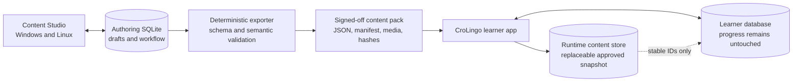
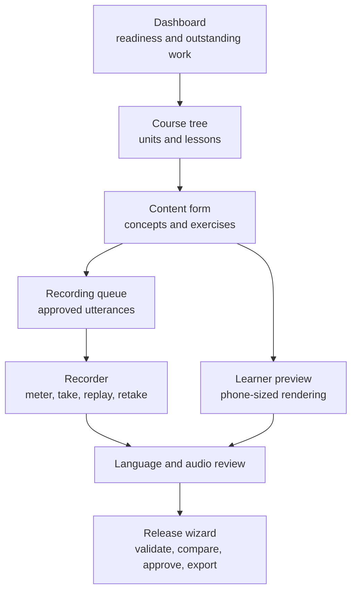
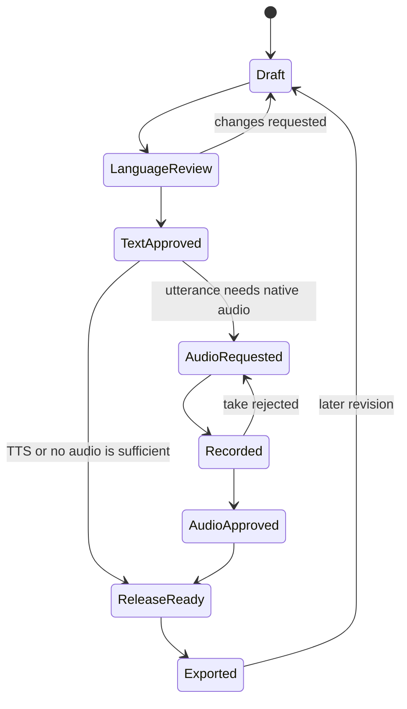

# CroLingo Content Studio

This document proposes a friendly desktop authoring application for course
editors, language reviewers, and native speakers. Its working name is
**CroLingo Content Studio**. It must hide JSON, database tables, filenames, and
audio tooling during normal work while producing deterministic, reviewable
content for the learner application.

## Recommendation

Build a separate Flutter desktop application for Windows and Linux inside this
repository at `tools/content_studio/`. Flutter is already CroLingo's UI
technology and officially supports native applications and plugins on both
desktop platforms. Windows builds must run on Windows and Linux builds on
Linux, so CI needs one runner for each platform. See Flutter's
[desktop documentation](https://docs.flutter.dev/platform-integration/desktop)
and [supported-platform matrix](https://docs.flutter.dev/reference/supported-platforms).

Keep it as an auxiliary application package, not a feature compiled into the
learner executable. The monorepo retains one SemVer source in the root
`pubspec.yaml`; editor builds receive that version from repository tooling.
This avoids shipping authoring dependencies, microphone access, and private raw
recordings in the learner app while allowing shared Dart packages for content
models, migrations, validation, and deterministic export code.

The first useful release should import and export CroLingo's current JSON. It
should not wait for native audio playback or runtime content downloads.

## Review outcome

The concept is viable and should proceed. A separate desktop editor is the
right boundary: it can share schemas and validation with CroLingo without
giving the learner app microphone, authoring, migration, or private-media
responsibilities. Flutter remains a practical choice because the editor needs
forms, previews, audio capture, and portable Windows and Linux builds rather
than platform-specific desktop integration.

The review adopts these architectural decisions:

- the approved, deterministic Git snapshot is the published source of truth;
- the editor database is a local, recoverable authoring workspace, not an
  artifact that application builds consume;
- stable released IDs and learner progress form a permanent compatibility
  contract;
- importing, migrating, backing up, and exporting are transactional operations;
- text authoring and validation are delivered before recording features;
- audio capture is isolated behind an adapter and proven on both platforms
  before a package is selected permanently;
- the editor never commits, pushes, tags, or silently replaces approved data;
- no cloud service, account system, AI authoring, or runtime content download
  belongs in version one.

This deliberately favors predictable recovery and review over clever
automation. One person can still complete the entire workflow without knowing
Git, JSON, SQLite, FFmpeg, or Flutter.

## Repository and ownership boundaries

Use this target structure:

```text
packages/content_core/          typed schema, validation, canonical export
tools/content_studio/           Windows and Linux Flutter editor
schemas/content/                machine-readable exported format schemas
assets/content/                 approved generated course snapshot
assets/audio/                   approved generated application audio
media/native_audio/             ignored local masters and private records
```

`content_core` must be a platform-independent Dart package used by both apps.
It owns format models, compatibility rules, semantic validation, normalized
comparison, and deterministic serialization. It must not depend on Flutter,
Drift, a file picker, or either application's presentation layer. The editor
maps its richer authoring records to that contract; CroLingo only reads the
contract.

The approved files under `assets/` are canonical for releases and code review.
The local authoring project is canonical only for unfinished drafts. On first
use, Content Studio imports the approved snapshot into a new project. Later it
records the snapshot hash it was based on and refuses to overwrite a newer
snapshot until the user imports or explicitly reconciles it. This prevents an
old laptop project from erasing somebody else's approved changes.

An export has two distinct commands:

1. **Validate and preview** writes a candidate to a temporary directory and
   shows semantic changes, media changes, and validation results.
2. **Approve and apply** requires an explicit confirmation, atomically replaces
   the approved generated files, and records the exact hashes in the local
   export history.

The editor never runs `git commit`, `git push`, or a release workflow. A
maintainer reviews the normal Git diff and uses the repository process.

## The three data lifecycles

CroLingo already has a versioned Drift/SQLite database at schema version 2. It
stores attempts, lesson checkpoints, study days, and settings. It does **not**
store course content. The current course is the bundled
`assets/content/course_de_hr.json`, which does not yet declare a content schema
version.

The editor should not write into the learner database. Three independent stores
are safer:

| Store | Owner | Contains | Versioning |
| --- | --- | --- | --- |
| Authoring database | Content Studio | Editable course graph, drafts, reviews, recording metadata | Forward-only integer schema migrations |
| Runtime content store | CroLingo app | Approved text and media index only | Content schema plus content release version |
| Learner database | CroLingo app | Attempts, progress, review history, settings | Existing forward-only Drift migrations |



Initially, the runtime content store remains the existing validated JSON asset.
When course size or downloadable packs justify it, CroLingo can transactionally
import an approved pack into a separate content SQLite database. It should
build the new database beside the active one, validate it, then atomically swap
it. A failed import keeps the prior content. Learner progress is never rebuilt
or deleted during a content update.

## Stable identity and compatibility

IDs are permanent public keys once released. Renaming or reusing concept,
lesson, exercise, utterance, speaker, or recording IDs is forbidden. Display
text may change. If an exercise's meaning or grading contract changes
substantially, create a new exercise ID and retire the old one so historical
attempts do not acquire a different meaning.

New IDs are lowercase ASCII slugs. They may be edited until the first approved
export and become read-only afterward. A committed tombstone registry prevents
retired IDs from ever being reused. Deleting a released object means retiring
it and removing it from future navigation; it remains resolvable for history
and migration diagnostics.

The following changes keep an exercise ID: punctuation, typo, explanation, or
display-only wording corrections that do not alter what counts as a correct
answer. The following changes require a new exercise ID: language direction,
exercise family, mastery dimension, concept ownership, intended meaning, or a
material change to accepted answers. The release comparison classifies these
changes and blocks approval when a released ID appears to have changed its
semantic contract.

Ordering is explicit data, not part of an ID. Units, lessons, and items use
integer positions and the exporter emits their canonical order. Reordering
never renames an item or invalidates learner history.

Use four independent versions:

1. Repository SemVer shared by CroLingo and Content Studio, defined only in the
   root `pubspec.yaml`.
2. Authoring database integer schema version.
3. Exported content format integer `schemaVersion`.
4. Approved course release SemVer and monotonically increasing
   `contentRevision`.

Every exported manifest should include `courseId`, `schemaVersion`,
`contentVersion`, `contentRevision`, `minimumAppVersion`, language tags,
ordered file entries, sizes, and SHA-256 hashes. Exports must use normalized
UTF-8, stable key ordering, stable list ordering, LF endings, and no volatile
timestamp. Identical approved input must produce byte-identical output.

The learner app declares the content schema versions it understands. The
editor can evolve first while still exporting the old schema; new app code can
support both old and new schemas during a transition. The app repository pins
one approved exported snapshot, so app and content work can proceed in
parallel without reading each other's unfinished databases.

Course releases use normal SemVer meaning: patch for corrections that preserve
learning semantics, minor for compatible added or retired material, and major
for a content-format or curriculum contract that requires coordinated app
support. `contentRevision` increases on every approved export, including a
replacement audio take. `minimumAppVersion` is raised only when the snapshot
uses behavior older apps cannot interpret.

## Authoring model

Use normalized SQLite tables in the editor rather than one JSON blob. The
minimum model is:

- courses, units, lessons, concepts, and ordered lesson items;
- exercises, accepted answers, matching pairs, tiles, distractors, and mastery
  dimensions;
- utterances with exact text, `hr-HR` or `de-DE`, context, and TTS text;
- speakers, consent/license records, recording takes, reviews, and approvals;
- grammar notes, tags, difficulty, retirement state, and change notes;
- immutable export records containing version, reviewer, hashes, and status.

Audio files should remain normal files, not SQLite BLOBs. The database stores
relative paths, hashes, format facts, status, and relationships. A project is a
folder containing the authoring database, a media tree, and automatic backups;
the whole folder is the backup unit.

SQLite foreign keys are enabled and every user action is one transaction. The
editor uses a single-writer project lock and detects a stale lock safely rather
than allowing two processes to write. Before a schema migration it closes the
database, copies the complete project metadata, migrates the copy, runs SQLite
integrity and foreign-key checks, and only then swaps it into place. Downgrades
are read-only and require export through a compatible newer editor.

Create an automatic verified backup before each migration and approved export,
plus time-based snapshots while the project changes. Retain at least the latest
20 successful snapshots and never delete the final known-good backup. Backup
and restore are visible commands with a dry-run summary; recovery must not
depend on manually copying hidden files.

## Main user experience

The application should open into a dashboard showing validation failures,
unreviewed text, missing recordings, rejected takes, and the last approved
export. Normal editing uses autosave, undo/redo, keyboard shortcuts, searchable
tables, and clear unsaved/export states.



Recommended screens:

- **Course tree:** reorder units, lessons, and exercises with guarded drag and
  drop; retired items remain visible in history.
- **Concept editor:** Croatian, German, usage/context, notes, and linked
  exercises with exposure and recall-direction counters.
- **Exercise builder:** type-specific forms and a live learner preview; users
  never edit irrelevant empty arrays.
- **Utterance library:** deduplicated phrases, both language tags, recording
  coverage, speaker, license, waveform, and all places where a phrase is used.
- **Recording desk:** input-device selection, level meter, count-in, one-click
  record/stop, replay, keep/reject, notes, and next-script navigation.
- **Review queue:** side-by-side German/Croatian approval and separate audio
  approval with an audit trail.
- **Release wizard:** validation summary, changes since the prior export,
  compatibility result, explicit sign-off, and deterministic output location.

The primary layout should target a minimum 1100 x 700 desktop window, remain
usable with 200 percent text scaling, and provide full keyboard navigation.
Destructive actions require an undo path or confirmation. Autosave shows
`Saving`, `Saved`, or a concrete failure; it must never imply that a failed
transaction was stored. Search spans IDs, Croatian and German text, tags, and
validation messages. Bulk edit is deferred until the single-item forms prove
their validation rules.

The learner preview uses the actual shared content model and representative
CroLingo widgets where practical, but it is clearly labelled as a preview. It
offers the supported phone viewport and 200 percent text mode. It does not
pretend to simulate persisted progress, scheduling, platform TTS, or the exact
physical-device audio experience.

## Text and exercise workflow



The editor continuously runs fast field and reference checks. Full export adds
the same semantic validation as CroLingo: unique stable IDs, known references,
valid exercise/type combinations, accepted answers, minimum exposures, and
both recall directions. It should also warn about changed released IDs,
unintroduced concepts, duplicate phrases, suspicious punctuation or Unicode,
missing translations, and changed accepted-answer semantics.

Automated checks never approve language naturalness. Croatian/German review is
an explicit human gate, and AI suggestions remain drafts with recorded
provenance until a person approves them.

Validation has three severities. Errors block approval; warnings require an
explicit acknowledgement and stored reason; information is advisory. Every
message identifies the object, field, problem, and a direct navigation action.
The pipeline treats unacknowledged warnings as failures, but it never treats an
acknowledgement as language approval.

The editor distinguishes a `Concept` from an `Utterance`. A concept is the
teachable meaning and may have several surface forms or contexts. An utterance
is exact speakable text. Template vocabulary such as `Ja sam ...` is not sent
to a speaker literally: the editor requires an approved natural exemplar such
as `Ja sam Ana.` or marks the template as TTS-only. One canonical Croatian
utterance per concept is the initial recording scope; prompts, explanations,
German speech, and context variants may be added later without changing the
concept ID.

## Recording and playback model

Every speakable string becomes an `Utterance` with a stable ID, exact text,
language tag, context, and optional native recordings. The same utterance may
be reused by concepts, prompts, answers, explanations, and future listening
exercises. A recording is one speaker's take of one utterance; it never owns
the text.

Version one records the Croatian vocabulary utterances with one native speaker
using an ordinary headset microphone. This is accepted as an iterative starting
point, not treated as studio-quality input. The recorder captures lossless mono
WAV masters at 48 kHz and 24-bit when the device supports it and flags clipping,
low level, excessive noise or silence, wrong channel count, unexpected sample
rate, duration outliers, and text changed after recording. Every take remains
replaceable without changing its utterance ID.

Start with a short cross-platform recording spike before building the full
desk. Put capture behind a `RecordingService` interface and test the current
maintained Flutter recording candidates on Windows 10/11 and supported Linux.
The chosen implementation must expose input-device selection, PCM WAV, level
metering, and recoverable errors. Playback uses the same tested audio boundary
as the learner app. CI uses fake capture and fixture WAV files; it never assumes
a microphone or sound device exists.

The recording desk begins with setup: choose an input, make a test recording,
confirm playback through headphones, and capture a few seconds of room tone.
It shows peak level during recording and provides keyboard-first record, stop,
replay, accept, reject, and next actions. A crash while recording may lose only
the active unaccepted take, never earlier accepted work.

Store the actual format reported by the device. Prefer PCM mono 48 kHz, 24-bit,
but accept genuine 16-bit headset input and never upsample it merely to claim a
higher-quality master. Empty, unreadable, truncated, multi-channel, unsupported,
or materially clipped input blocks approval. Low level, background noise,
unusual duration, and sample-rate differences produce measurable warnings for
human review. Quality thresholds are versioned export-tool configuration so a
future improvement cannot silently change old output.

The editor keeps raw approved masters and consent records. A reproducible
export step strips metadata, trims only approved boundary silence, normalizes
to the agreed safe target, and creates compact app assets. Noise reduction must
be optional, previewable, explicitly approved, and never overwrite the raw
take. Quality can therefore improve later without changing course references.

Derived application audio is mono Opus in Ogg at 48 kHz. The preparation step
is pinned and records its tool version and parameters. Initial loudness and
peak targets are established by an A/B listening test on the old Huawei, the
new Xiaomi, ordinary headphones, and Linux speakers; after approval those
numbers become versioned configuration. This is safer than choosing a nominal
broadcast or podcast target without testing the actual app and feedback sounds.
Replacing a take keeps the utterance and recording slot IDs but increments its
revision and changes the manifest hash.

The learner setting is separate for Croatian and German:

- **Automatic** (recommended): approved native recording, otherwise local TTS;
- **Native recording:** play a recording and report clearly if unavailable;
- **Device voice:** always use installed `hr-HR` or `de-DE` TTS;
- **Off:** hide or disable automatic speech while retaining manual text use.

These are source preferences, not an autoplay switch. Manual speaker buttons
remain explicit and accessible. In `Automatic`, an approved neutral native
recording is preferred and device TTS is the fallback. `Native recording`
never silently substitutes TTS; it explains that no recording exists. `Device
voice` never plays a bundled recording. `Off` disables speech playback without
affecting answer-feedback tones, which remain a separate setting.

Version one exposes one approved native Croatian speaker. The schema supports
multiple recordings, speakers, and styles later, similar to dictionary sites,
without making them visible before real variants exist. German uses device TTS
until approved German recordings are added. The content manifest maps each
utterance to available recordings and TTS fallback text; learner settings make
the final selection. Native audio and TTS share one playback boundary so
lessons remain usable when either source is unavailable.

## Export and integration

An approved pack should contain only generated files:

```text
manifest.json
course.json
audio-manifest.json
audio/hr/<speaker-id>/<utterance-id>.ogg
audio/de/<speaker-id>/<utterance-id>.ogg
licenses/<speaker-id>.json
SHA256SUMS.txt
```

Raw WAV masters, the editor database, private notes, and personal consent
documents are never bundled into the learner app. The manifest contains only
the minimum non-personal license facts needed to prove distribution rights.

The GPLv3 repository license does not by itself prove that CroLingo may edit
and redistribute a particular person's recorded voice. Before recording, the
speaker signs a project release covering worldwide app and source distribution,
editing and format conversion, attribution choice, retention of masters, and
the practical limits of withdrawing already distributed releases. Public files
use a pseudonymous speaker ID; legal identity and signed consent remain in
private storage. A maintainer must obtain legal advice if the intended license
or commercial use changes. The editor records the approved license identifier
and consent-document hash, never the private document itself.

Content CI should import the pack into a clean environment, validate schema and
semantics, verify every hash and media encoding, reject unknown or unlicensed
files, render representative exercise previews, and compare the deterministic
re-export. Only an approved pack version is copied into CroLingo and released
with the normal app pipeline. Runtime network downloads remain a separate later
decision requiring publisher signatures, rollback, size limits, and privacy
review.

## Safety, recovery, and collaboration

- Default to local-only operation with no account, analytics, or cloud upload.
- Ask for microphone permission only in Content Studio, never in CroLingo.
- Autosave each valid edit transaction and create rotating, verified backups.
- Provide restore, project integrity check, and export-before-migration.
- Migrate a copied authoring database first, verify it, then replace the
  original; never perform an irreversible in-place migration without backup.
- Keep speaker identities pseudonymous in content. Protect consent documents
  separately and define retention/deletion rules.
- Start with one active writer. Simultaneous editing, accounts, roles, and a
  synchronization server are out of scope.
- The same trusted native speaker may author, record, review, approve, and
  export in version one. Preserve an audit record even though this is not a
  separation-of-duties workflow.
- Keep the working authoring database, raw recordings, and private consent
  documents in an ignored local workspace. Commit editor source and approved
  deterministic exports only.
- Reject imported archives with absolute paths, parent traversal, links,
  oversized entries, duplicate normalized names, or undeclared files. Validate
  content before copying anything into an active project.
- Do not execute HTML, scripts, macros, media metadata, or paths supplied by a
  project. Open external links only after explicit confirmation.
- Store no credentials. Diagnostic exports redact local usernames, absolute
  paths, microphone names, and private notes by default.
- Keep all operation possible offline. Package checks and updates are a
  maintainer concern, not a network feature inside Content Studio.

## Quality gates and distribution

Content Studio follows the same engineering floor as CroLingo: bootstrapping,
conventional atomic commits, the single repository SemVer, formatting, Dart
analysis, Flutter/custom lint, unit/widget/integration tests, shell and workflow
lint, dependency and secret scans, at least 95% authored Dart line coverage,
clean builds, and artifact inspection. Test database migration fixtures from
every supported schema and golden deterministic exports.

Required test layers are:

- pure model, normalization, validation, compatibility, and canonical-export
  tests, including Unicode and malformed-input properties;
- authoring-database repository and forward-migration tests from every retained
  schema fixture, including interrupted and corrupt copies;
- import/current-snapshot and byte-identical export golden tests;
- widget tests for keyboard use, focus, undo, validation navigation, and 200
  percent text scaling;
- integration tests with fake file dialogs, fake recording, fixture media,
  backup/restore, and atomic export failures;
- media inspection with pinned tooling for encoding, channels, rates, hashes,
  duration, metadata, and manifest coverage;
- Windows and Linux clean build/package tests plus manual smoke tests on real
  audio hardware before a recording-capable release.

The editor has a focused, self-bootstrapping pipeline entry point used by the
root `localPipeline.sh`. The root pipeline remains the mandatory final
integration gate and validates the editor, exported content, bundled audio,
and learner app. A separate path-filtered `editor-quality.yml` workflow runs on
pushes and pull requests that touch `tools/content_studio/`, `content_core`,
schemas, editor fixtures, or content assets. It has a Linux quality/build job
and a Windows quality/build job, and uploads a portable Windows ZIP plus a
checksummed Linux bundle for testing. It does not repeat unrelated Android
builds, tag commits, or publish a public release.

Version one distributes a portable Windows ZIP; no installer is required. The
editor shows the repository version, authoring schema, content schema, and
project backup location in an About/Diagnostics screen.

## Implementation sequence

1. **Contract:** define content schema v1, manifest, stable-ID/tombstone rules,
   change classification, canonical serialization, and wireframes. Add the
   current course as an import/export golden fixture.
2. **Shared core:** extract typed models, validator, migrations, and canonical
   serializer into platform-independent Dart packages with fixtures.
3. **Editor foundation:** create `tools/content_studio/` as a Flutter
   Windows/Linux application, with a versioned Drift authoring database,
   project backups, current-JSON import, course tree, forms, search, undo/redo,
   and live preview.
4. **Review and export:** add workflow states, audit records, complete
   validation, deterministic exports, diffs, and app-repository snapshot import.
5. **Recording desk:** add cross-platform capture, meters, take management,
   consent/license tracking, media validation, and reproducible conversion.
6. **Learner integration:** add utterance/audio manifests, native/TTS source
   preferences for German and Croatian, fallback behavior, and tests.
7. **Runtime content store:** when justified by scale, add the separate
   transactional content database and rollback; keep learner progress isolated.
8. **Distribution:** portable Windows ZIP and checksummed Linux artifact,
   documentation, migration fixtures, and usability testing with the real
   editor and native speaker.

Each phase ends with a usable vertical slice. Text import/edit/export is the
first product milestone. Recording work begins only after that slice passes a
recovery exercise: import the current course, edit it, force a failed export,
restore a backup, and reproduce an identical approved snapshot.

## Definition of the first usable editor

A nontechnical author can import all current content, find and edit any item,
add a concept/lesson/exercise through guided forms, see all validation errors,
preview the learner presentation, save and reopen without loss, approve text,
and export byte-identical valid JSON without using a terminal. A native speaker
can open an approved script queue, record/replay/retake WAV takes, and hand an
audio batch to review without naming files manually.

Acceptance also requires surviving restart during editing, rejecting an older
project overwrite, restoring a verified backup, explaining every blocking
validation error, and producing a reviewable diff that changes no unrelated
generated file.

## Deliberately deferred scope

Do not include cloud sync, accounts, roles, simultaneous editing, an installer,
automatic Git operations, runtime pack download, rich-text/HTML content,
spreadsheet round-tripping, waveform editing, automatic noise removal, speech
recognition, pronunciation scoring, AI-generated approved content, or visible
multi-speaker selection in version one. The data model may leave compatible
extension points, but unused abstractions and UI are not implementation work.

## Decisions that still require human authority

Engineering defaults resolve the remaining technical choices. Only these gates
cannot responsibly be decided by an implementer:

1. **Recording rights:** the project owner and speaker must sign the final
   consent/license and choose public attribution before any voice is shipped.
2. **Language approval:** the native speaker must approve the exact Croatian
   text and delivery; validation cannot substitute for that judgment.
3. **Reference listening:** the owner and speaker must accept the first audio
   processing profile after listening on the two target phones and Linux.
4. **First published schema:** the owner must approve the human-readable diff
   from the first deterministic export because released IDs then become
   permanent.

These are explicit release gates, not questions that block implementation of
the text editor, shared schema, validation, backup, or preview.

## Adopted version-one decisions

1. One trusted person initially performs authoring, recording, review, approval,
   and export.
2. Content Studio stays in this repository under `tools/content_studio/`.
3. One active user is sufficient; simultaneous collaboration is out of scope.
4. Windows distribution is a portable ZIP.
5. Native recording initially covers Croatian vocabulary utterances.
6. Croatian and German each receive `Automatic`, `Native recording`,
   `Device voice`, and `Off` settings in CroLingo.
7. One canonical native speaker is exposed initially; the model remains capable
   of multiple recordings and styles later.
8. An ordinary headset microphone is acceptable initially, with measurable
   warnings, preserved raw takes, and replaceable improved recordings.
9. The native speaker is the final version-one approver.
10. Approved content and audio remain bundled with app releases and are checked
    by the mandatory root pipeline; runtime downloads remain deferred.
